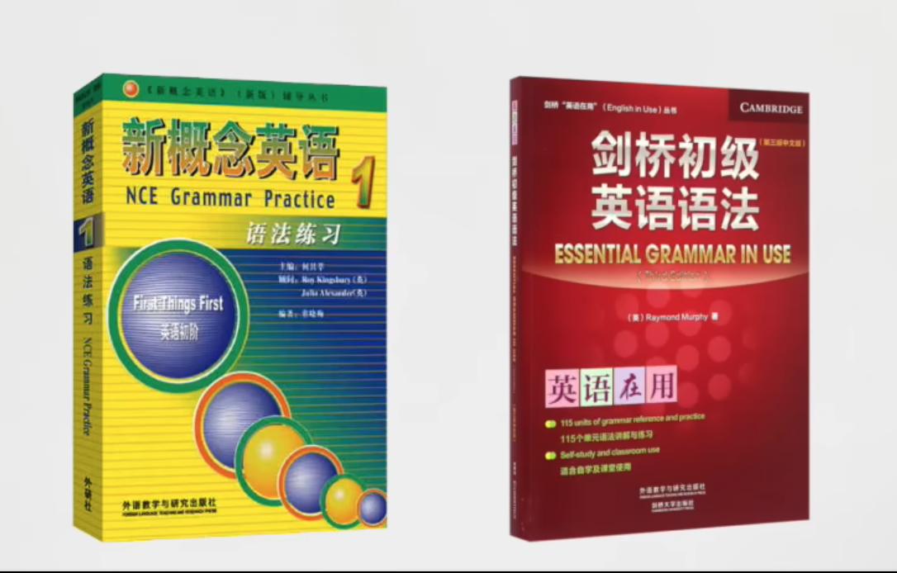

# english

我找了很多关于学习英语的方式，其实真的是最快的方式就是没有捷径, 所以我决定从新概念开始，我准备用3个月的时候学习完新概念12两本。

it's never too late to learn.

## 新概念英语1

- 准备红绿皮书
- 准备多个英语字典
- 准备手机app新概念文章音频，每天需要跟读练习
- 准备纸和笔进行造句练习
- 每天一定一定一定一定要跟读, 保质保量的完成.
  - 跟读的方法是用app读一句，暂停下来，我再读一句，最大努力的去模仿，如果感觉不出来味道，继续跟读相同的一句话，不要求快和多。
- 每天一定一定要泡耳朵，多听，比如跑步，开车，睡觉的时候都要多听。
- 做练习，做绿皮书和红皮书里面的练习。
  - 主要是加强对语法的熟练度,
  - 绿皮书最后是答案，
  - 红皮书后面的练习才是最重要的重点。要在最后找index才能找到我们需要练习的题目。
- Ask me if & Comprehension
- 不停的造句，造句和短语最重要

<!--  -->

